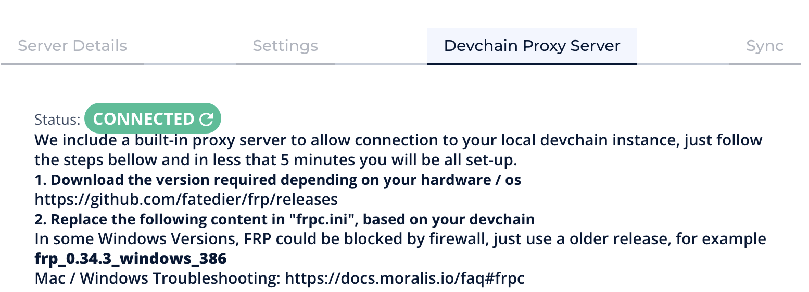
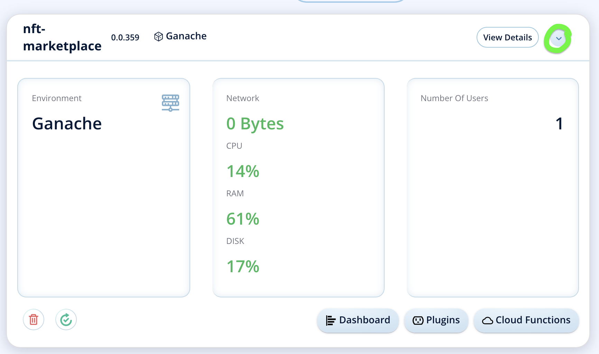
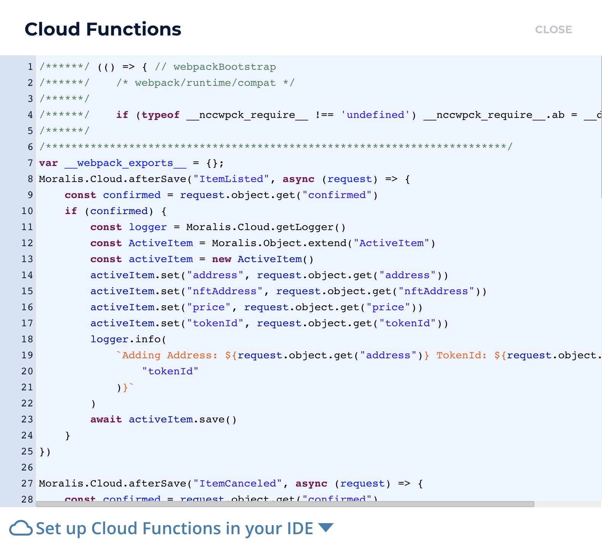

# Hardhat NextJS NFT Marketplace 

<br/>
<p align="center">

</a>
</p>
<br/>

This is a repo showing how to make an NFT Marketplace from scratch!

Video Coming soon...

[Full Repo](https://github.com/smartcontractkit/full-blockchain-solidity-course-js)

- [Hardhat NextJS NFT Marketplace](#hardhat-nextjs-nft-marketplace)
- [Getting Started](#getting-started)
  - [Requirements](#requirements)
  - [Quickstart](#quickstart)
    - [Full-Stack Local Quickstart](#full-stack-local-quickstart)
  - [Typescript](#typescript)
- [Usage](#usage)
  - [Testing](#testing)
- [Deployment to a testnet or mainnet](#deployment-to-a-testnet-or-mainnet)
- [Thank you!](#thank-you)


# Getting Started

## Requirements

- [git](https://git-scm.com/book/en/v2/Getting-Started-Installing-Git)
  - You'll know you did it right if you can run `git --version` and you see a response like `git version x.x.x`
- [Nodejs](https://nodejs.org/en/)
  - You'll know you've installed nodejs right if you can run:
    - `node --version` and get an ouput like: `vx.x.x`
- [Yarn](https://classic.yarnpkg.com/lang/en/docs/install/) instead of `npm`
  - You'll know you've installed yarn right if you can run:
    - `yarn --version` and get an output like: `x.x.x`
    - You might need to install it with `npm`

## Quickstart

```
git clone https://github.com/PatrickAlphaC/hardhat-nextjs-nft-marketplace-fcc
cd hardhat-nextjs-nft-marketplace-fcc
yarn
```

### Full-Stack Local Quickstart


1. Start your node 

After installing dependencies, start a node on it's own terminal with:

```
yarn hardhat node
```

You'll see a line in the output that tells you where your `NftMarketplace` is running, be sure to grab that address. You'll want to update the value in `front-end-typescript/constants/networkMapping.json` for the correct chain ID with this new address. 

2a. Setup your indexing service

Setup your event indexing with either [the graph](https://thegraph.com/en/) or [moralis](https://moralis.io/). For this demo, we are going to use Moralis.

Sign up for a [free account here](https://moralis.io/).

Once setup, update your `front-end-typescript/.env` file:

```
NEXT_PUBLIC_MORALIS_APP_ID=XXXX
NEXT_PUBLIC_MORALIS_SECRET=XXXX
NEXT_PUBLIC_MORALIS_SERVER_URL=XXXX
moralisApiKey=XXX
moralisApiSecret=XXX
moralisSubdomain=XXX
```

With the values from your account. 

2b. Setup your Moralis reverse proxy 

On your server, click on "View Details" and then "Devchain Proxy Server" and follow the instructions. You'll want to use the `hardhat` connection. 

You'll know you've done it right when you can see a green `connected` button after hitting the refresh symbol next to `DISCONNECTED`



2c. Setup your Cloud functions

In your `front-end-typescript/package.json` update the following lines:
```
"moralis:sync": "moralis-admin-cli connect-local-devchain --chain hardhat --moralisSubdomain XXX.usemoralis.com --frpcPath ./frp/frpc",
"moralis:cloud": "moralis-admin-cli watch-cloud-folder  --moralisSubdomain XXX.usemoralis.com --autoSave 1 --moralisCloudfolder ./cloudFunctions",
"moralis:logs": "moralis-admin-cli get-logs --moralisSubdomain XXX.usemoralis.com"
```

Replace the `XXX.usemoralis.com` with your subdomain, like `4444acatycat.usemoralis.com`and update the `moralis:sync` script's path to your instance of `frp` (downloaded as part of the Moralis "Devchain Proxy Server" instructions mentioned above)

If you don't have `moralis-admin-cli` installed already, install it globally with `npm i -g moralis-admin-cli`.

Then run `yarn moralis:cloud` in one terminal, and run `yarn moralis:logs` in another. Make sure you're in the `front-end-typescript` directory in each terminal.

If you hit the little down arrow in your server, then hit `Cloud Functions` you should see text in there. 




Run `yarn moralis:sync` in another terminal to connect your local Hardhat devchain with your Moralis instance.

2d. Add your event listeners

Finally, go to `View Details` -> `Sync` and hit `Add New Sync` -> `Sync and Watch Contract Events`

Add the following 3 events:

1. ItemListed:
   1. Description: ItemListed
   2. Sync_historical: True
   3. Topic: ItemListed(address,address,uint256,uint256)
   4. Abi: 
```
{
  "anonymous": false,
  "inputs": [
    {
      "indexed": true,
      "internalType": "address",
      "name": "seller",
      "type": "address"
    },
    {
      "indexed": true,
      "internalType": "address",
      "name": "nftAddress",
      "type": "address"
    },
    {
      "indexed": true,
      "internalType": "uint256",
      "name": "tokenId",
      "type": "uint256"
    },
    {
      "indexed": false,
      "internalType": "uint256",
      "name": "price",
      "type": "uint256"
    }
  ],
  "name": "ItemListed",
  "type": "event"
}
```
    5. Address: <YOUR_NFT_MARKETPLACE_DEPLOYED_ADDRESS_FROM_HARDHAT>
    6. TableName: ItemListed

You can add the canceled and bought events later. 

3. Mint and List your NFT

Back in the main directory, run:

```
yarn hardhat run scripts/mint-and-list-item.js --network localhost
```

And you'll now have an NFT listed on your marketplace. 

4. Start your front end

```
cd front-end-typescript
yarn run dev
```

And you'll have your front end, indexing service running, and blockchain running. 

## Typescript

TODO!!

For the typescript edition, run:

```
git checkout typescript
```


# Usage

Deploy:

```
yarn hardhat deploy
```

## Testing

```
yarn hardhat test
```


# Deployment to a testnet or mainnet

1. Setup environment variabltes

You'll want to set your `KOVAN_RPC_URL` and `PRIVATE_KEY` as environment variables. You can add them to a `.env` file, similar to what you see in `.env.example`.

- `PRIVATE_KEY`: The private key of your account (like from [metamask](https://metamask.io/)). **NOTE:** FOR DEVELOPMENT, PLEASE USE A KEY THAT DOESN'T HAVE ANY REAL FUNDS ASSOCIATED WITH IT.
  - You can [learn how to export it here](https://metamask.zendesk.com/hc/en-us/articles/360015289632-How-to-Export-an-Account-Private-Key).
- `KOVAN_RPC_URL`: This is url of the kovan testnet node you're working with. You can get setup with one for free from [Alchemy](https://alchemy.com/?a=673c802981)

2. Get testnet ETH

Head over to [faucets.chain.link](https://faucets.chain.link/) and get some tesnet ETH. You should see the ETH show up in your metamask.

3. Deploy

```
yarn hardhat deploy --network kovan
```


# Thank you!

If you appreciated this, feel free to follow me or donate!

ETH/Polygon/Avalanche/etc Address: 0x9680201d9c93d65a3603d2088d125e955c73BD65

[](https://twitter.com/PatrickAlphaC)
[](https://www.youtube.com/channel/UCn-3f8tw_E1jZvhuHatROwA)
[](https://www.linkedin.com/in/patrickalphac/)
[](https://medium.com/@patrick.collins_58673/)