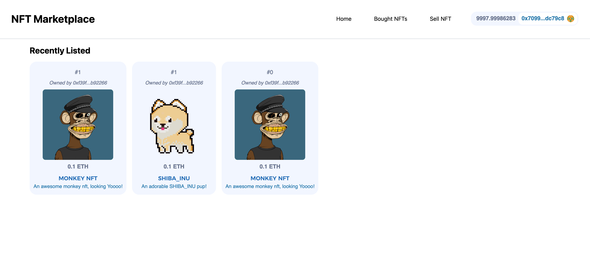

# Hardhat NFT Marketplace 

*This repo has been updated to work with Goerli over Rinkeby.*

<br/>
<p align="center">

</a>
</p>
<br/>

This is a repo showing how to make an NFT Marketplace from scratch!

Huge Shoutout to [Matt Durkin](https://twitter.com/mdurkin92) for his help on this repo!

[Full Repo](https://github.com/smartcontractkit/full-blockchain-solidity-course-js)

- [Hardhat NFT Marketplace](#hardhat-nft-marketplace)
- [Getting Started](#getting-started)
  - [Requirements](#requirements)
  - [Quickstart](#quickstart)
  - [Typescript](#typescript)
    - [Optional Gitpod](#optional-gitpod)
- [Usage](#usage)
  - [Testing](#testing)
- [Deployment to a testnet or mainnet](#deployment-to-a-testnet-or-mainnet)
- [Thank you!](#thank-you)


# Getting Started

## Requirements

- [git](https://git-scm.com/book/en/v2/Getting-Started-Installing-Git)
  - You'll know you did it right if you can run `git --version` and you see a response like `git version x.x.x`
- [Nodejs](https://nodejs.org/en/)
  - You'll know you've installed nodejs right if you can run:
    - `node --version` and get an ouput like: `vx.x.x`
- [Yarn](https://classic.yarnpkg.com/lang/en/docs/install/) instead of `npm`
  - You'll know you've installed yarn right if you can run:
    - `yarn --version` and get an output like: `x.x.x`
    - You might need to install it with `npm`

## Quickstart

```
git clone https://github.com/PatrickAlphaC/hardhat-nextjs-nft-marketplace-fcc
cd hardhat-nextjs-nft-marketplace-fcc
yarn
```

## Typescript

TODO!!

For the typescript edition, run:

```
git checkout typescript
```

### Optional Gitpod

If you can't or don't want to run and install locally, you can work with this repo in Gitpod. If you do this, you can skip the `clone this repo` part.

[](https://gitpod.io/#github.com/PatrickAlphaC/hardhat-nft-marketplace-fcc)

> Remember if you are using gitpod then you cannot connect your local hardhat node with metamask. To resolve this you can use vs code or testnets instead of local node.


# Usage

Deploy:

```
yarn hardhat deploy
```

## Testing

```
yarn hardhat test
```


# Deployment to a testnet or mainnet

1. Setup environment variabltes

You'll want to set your `GOERLI_RPC_URL` and `PRIVATE_KEY` as environment variables. You can add them to a `.env` file, similar to what you see in `.env.example`.

- `PRIVATE_KEY`: The private key of your account (like from [metamask](https://metamask.io/)). **NOTE:** FOR DEVELOPMENT, PLEASE USE A KEY THAT DOESN'T HAVE ANY REAL FUNDS ASSOCIATED WITH IT.
  - You can [learn how to export it here](https://metamask.zendesk.com/hc/en-us/articles/360015289632-How-to-Export-an-Account-Private-Key).
- `GOERLI_RPC_URL`: This is url of the goerli testnet node you're working with. You can get setup with one for free from [Alchemy](https://alchemy.com/?a=673c802981)

2. Get testnet ETH

Head over to [faucets.chain.link](https://faucets.chain.link/) and get some tesnet ETH. You should see the ETH show up in your metamask.

3. Deploy

```
yarn hardhat deploy --network goerli
```


# Thank you!

If you appreciated this, feel free to follow me or donate!

ETH/Polygon/Avalanche/etc Address: 0x9680201d9c93d65a3603d2088d125e955c73BD65

[](https://twitter.com/PatrickAlphaC)
[](https://www.youtube.com/channel/UCn-3f8tw_E1jZvhuHatROwA)
[](https://www.linkedin.com/in/patrickalphac/)
[](https://medium.com/@patrick.collins_58673/)
